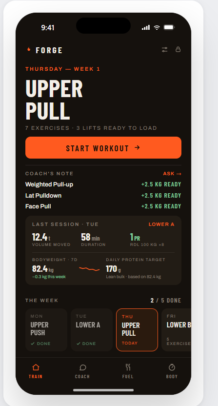
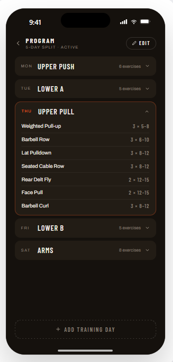
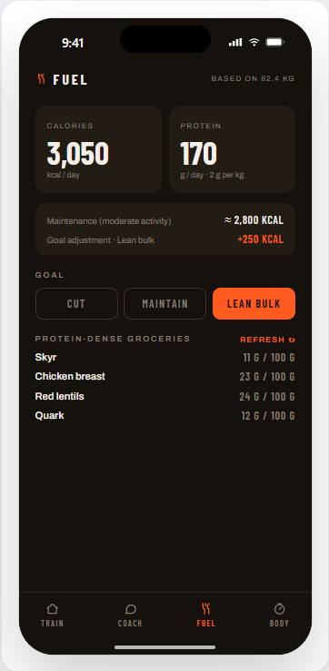

# Forge

A personal strength-training tracker — a mobile-first, installable PWA that logs your lifts, coaches your progression, and keeps tabs on bodyweight, nutrition, and progress photos. Single-user and passcode-gated; built to live on your phone's home screen.

Forge follows one progression rule end to end: **reps first, then weight.** Hit the top of the prescribed rep range on every working set, then add load next session. The session UI, the analytics, and the AI coach all speak that same language.

## Screenshots

<table>
  <tr>
    <td width="33%"></td>
    <td width="33%"></td>
    <td width="33%"></td>
  </tr>
</table>

## Features

- **Workout tracker** — an editable multi-day program, per-set logging with a rest timer, and inline "ready to add weight" suggestions driven by a pure progression engine.
- **Smart progression** — automatic deload weeks, plateau detection with break strategies, and reps-first → weight increment suggestions (compound +2.5–5 kg, isolation +1–2.5 kg).
- **AI coach** — a streaming chat coach grounded in your actual logged training. Multi-provider (Anthropic, OpenRouter, Google Gemini, OpenAI, or any OpenAI-compatible gateway), configurable in-app or via env. Degrades gracefully when no provider is set.
- **Proactive coach's note** — a glanceable home-screen note that surfaces plateaus and lifts ready for more load, with no model call (computed from the progression flags) until you tap through.
- **Bodyweight tracker** — weigh-in log with weekly averages and a trend chart.
- **Nutrition** — daily calorie + protein targets auto-computed from your bodyweight, activity, and goal, plus on-demand AI grocery lists and meal ideas that hit your targets.
- **Progress photos** — private, device-local photo gallery.
- **English & German** — full i18n with a cookie-based locale (auto-detected from your browser), including AI responses that follow the UI language.
- **PWA** — installable, offline-aware shell, dark theme, designed for one-handed phone use.

## Tech stack

- **Next.js 16** (App Router, Turbopack) and **React 19**
- **Drizzle ORM** on **libsql / Turso** (SQLite)
- **Tailwind CSS v4** with shadcn-style components and `lucide-react` icons
- **TypeScript**, **Vitest** for the pure logic modules
- Provider SDKs: `@anthropic-ai/sdk` plus OpenAI-compatible streaming over `fetch`

## Getting started

Requires Node 20+.

```bash
# 1. Install dependencies
npm install

# 2. Configure environment
cp .env.example .env.local
#    → set APP_PASSCODE (the code you'll type to unlock the app)
#    → optionally add ONE AI provider key (e.g. ANTHROPIC_API_KEY) to enable the coach

# 3. Create the database schema (defaults to a local SQLite file)
npm run db:push

# 4. Seed a starter 5-day program
npm run db:seed

# 5. Run it
npm run dev
```

Open [http://localhost:3000](http://localhost:3000) and unlock with your `APP_PASSCODE`.

## Configuration

All configuration lives in `.env.local` (see `.env.example` for the full, annotated list):

| Variable | Purpose |
| --- | --- |
| `APP_PASSCODE` | The passcode that unlocks the app. Changing it logs every device out. |
| `TURSO_DATABASE_URL` | Database URL. Defaults to `file:local.db` for local dev; use a `libsql://…` URL for Turso in production. |
| `TURSO_AUTH_TOKEN` | Turso auth token (production only). |
| `ANTHROPIC_API_KEY` *(or another provider key)* | Enables the AI coach. The coach auto-detects a provider in the order anthropic → openrouter → gemini → openai → custom, or pin one with `COACH_PROVIDER` / `COACH_MODEL`. |

The AI coach is entirely optional — without any provider key it simply stays disabled, and you can also connect a provider from the in-app **Settings** screen (stored in the database, takes precedence over env).

## Scripts

| Command | Description |
| --- | --- |
| `npm run dev` | Start the dev server (Turbopack). |
| `npm run build` | Production build. |
| `npm run start` | Serve the production build. |
| `npm run lint` | Run ESLint. |
| `npm run test` | Run the Vitest unit suite (pure logic: progression, coach, nutrition, i18n). |
| `npm run db:push` | Apply the Drizzle schema to the database. |
| `npm run db:generate` | Generate a SQL migration from the schema. |
| `npm run db:seed` | Seed a starter program. |

## Project layout

```
src/
  app/            Routes (App Router) + route handlers for streaming AI + photos
  components/     UI: session, program, coach, nutrition, bodyweight, photos, charts
  db/             Drizzle schema + seed
  lib/            Pure logic (progression, coach, nutrition, bodyweight, i18n) + DB queries/mutations
  proxy.ts        Passcode gate + locale resolution (this Next.js renames middleware → proxy)
```

The `lib/` modules that hold the real logic — progression, coaching briefs, nutrition targets, the locale picker — are pure (no DB or network) and unit-tested.

## Deployment notes

- **Database:** for anything beyond local use, point `TURSO_DATABASE_URL` / `TURSO_AUTH_TOKEN` at a [Turso](https://turso.tech) database.
- **Progress photos** are stored on the local filesystem (`data/photos/`, gitignored). That works on a long-running server but **not** on serverless platforms — swap `src/lib/photo-storage.ts` for object storage (e.g. S3/R2/Blob) before deploying there.
- Set a real `APP_PASSCODE` before exposing the app.

## License

Released under the [MIT License](LICENSE).
