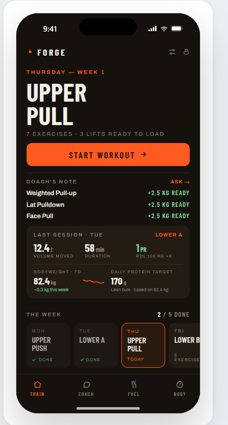
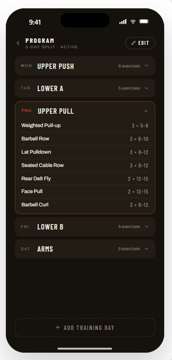
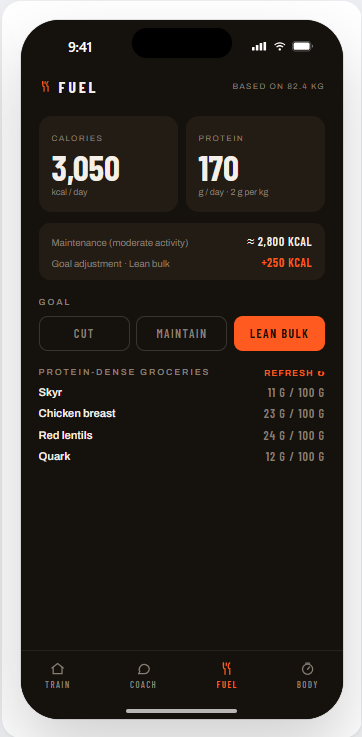

# Forge

Forge is a personal strength-training tracker. It runs as a mobile-first PWA that you install on your phone and open with a passcode. It logs your lifts and tells you when to add weight. It also keeps your bodyweight, nutrition, and progress photos in one place. One person, one passcode, no accounts.

The whole app follows a single rule: reps first, then weight. Hit the top of the prescribed rep range on every working set, then add load the next session. The session screen, the charts, and the AI coach all speak that same language.

## Screenshots

<table>
  <tr>
    <td width="33%"></td>
    <td width="33%"></td>
    <td width="33%"></td>
  </tr>
</table>

## Features

- **Workout tracker.** An editable multi-day program with per-set logging, a rest timer, and inline "ready to add weight" hints from a pure progression engine.
- **Smart progression.** Automatic deload weeks, plateau detection with break strategies, and reps-first to weight increment suggestions (compound +2.5 to 5 kg, isolation +1 to 2.5 kg).
- **AI coach.** A streaming chat coach grounded in your actual logged training. It works with Anthropic, OpenRouter, Google Gemini, OpenAI, or any OpenAI-compatible gateway, set up in-app or through env. If no provider is configured, the coach just stays off.
- **Proactive coach note.** A glanceable home-screen note that flags plateaus and lifts ready for more load. It costs no model call, since it reads the progression flags directly, until you tap through to chat.
- **Bodyweight tracker.** A weigh-in log with weekly averages and a trend chart.
- **Nutrition.** Daily calorie and protein targets computed from your bodyweight, activity, and goal, plus on-demand AI grocery lists and meal ideas that hit those targets.
- **Progress photos.** A private photo gallery kept on your own device or server.
- **English and German.** Full i18n with a cookie-based locale that auto-detects from your browser. AI replies follow the UI language too.
- **PWA.** Installable, dark by default, with an offline-aware shell, built for one-handed use at the gym.

## Tech stack

- **Next.js 16** (App Router, Turbopack) and **React 19**
- **Drizzle ORM** on **libsql / Turso** (SQLite)
- **Tailwind CSS v4** with shadcn-style components and `lucide-react` icons
- **TypeScript**, with **Vitest** covering the pure logic modules
- Provider SDKs: `@anthropic-ai/sdk` plus OpenAI-compatible streaming over `fetch`

## Getting started

You need Node 20 or newer for local development.

```bash
# 1. Install dependencies
npm install

# 2. Configure environment
cp .env.example .env.local
#    set APP_PASSCODE (the code you type to open the app)
#    optionally add ONE AI provider key (e.g. ANTHROPIC_API_KEY) to turn on the coach

# 3. Create the database schema (defaults to a local SQLite file)
npm run db:push

# 4. Seed a starter 5-day program
npm run db:seed

# 5. Run it
npm run dev
```

Open [http://localhost:3000](http://localhost:3000) and unlock with your `APP_PASSCODE`.

## Configuration

All configuration lives in `.env.local`. See `.env.example` for the full annotated list.

| Variable | Purpose |
| --- | --- |
| `APP_PASSCODE` | The passcode that opens the app. Changing it logs every device out. |
| `TURSO_DATABASE_URL` | Database URL. Defaults to `file:local.db` for local dev. Use a `libsql://…` URL for Turso in production. |
| `TURSO_AUTH_TOKEN` | Turso auth token, production only. |
| `ANTHROPIC_API_KEY` (or another provider key) | Turns on the AI coach. The coach auto-detects a provider in the order anthropic, openrouter, gemini, openai, custom. Pin one with `COACH_PROVIDER` or `COACH_MODEL`. |

The AI coach is optional. With no provider key it stays disabled, and you can also connect a provider from the in-app **Settings** screen. Settings values are stored in the database and take precedence over env.

## Scripts

| Command | Description |
| --- | --- |
| `npm run dev` | Start the dev server (Turbopack). |
| `npm run build` | Production build. |
| `npm run start` | Serve the production build. |
| `npm run lint` | Run ESLint. |
| `npm run test` | Run the Vitest suite (pure logic: progression, coach, nutrition, i18n). |
| `npm run db:push` | Apply the Drizzle schema to the database. |
| `npm run db:generate` | Generate a SQL migration from the schema. |
| `npm run db:seed` | Seed a starter program. |

## Project layout

```
src/
  app/            Routes (App Router) plus route handlers for streaming AI + photos
  components/     UI: session, program, coach, nutrition, bodyweight, photos, charts
  db/             Drizzle schema + seed
  lib/            Pure logic (progression, coach, nutrition, bodyweight, i18n) + DB queries/mutations
  proxy.ts        Passcode gate + locale resolution (this Next.js renames middleware to proxy)
```

The `lib/` modules that hold the real logic (progression, coaching briefs, nutrition targets, the locale picker) are pure. No DB, no network. They carry their own Vitest coverage.

## Self-hosting with Docker

The repo ships a `Dockerfile`, a `docker-compose.yml`, and a `.dockerignore`, so you can run Forge on your own server without installing Node there. Docker builds the app and installs the dependencies inside the image. The host only needs Docker with the Compose plugin.

The database and the progress photos both live under `./data`, which is mounted into the container as a volume. Back up that one folder and you have backed up everything.

```bash
# 1. Set the passcode first. Compose reads .env before it does anything,
#    so this file has to exist before any compose command.
echo 'APP_PASSCODE=your-strong-passcode' > .env

# 2. Create the data folder for the database and photos
mkdir -p data

# 3. Initialize the database. The first run also builds the image,
#    which is where dependencies get installed inside Docker.
docker compose run --rm db-tools npm run db:push    # create the tables
docker compose run --rm db-tools npm run db:seed    # load the starter program (one time only, this wipes)

# 4. Build and start the app
docker compose up -d --build
```

The container listens on `127.0.0.1:3000`, so it is not exposed on your LAN or the internet by default. Check it with `docker compose ps` and `curl -I localhost:3000`, which should return a redirect to `/login`.

To change the passcode later, edit `.env` and run `docker compose up -d` again. To update after a code change, pull and rebuild with `docker compose up -d --build`.

### Remote access with Tailscale

[Tailscale](https://tailscale.com) gives you a private, encrypted path to the app from your own devices, with no open ports. Install it on the server, then publish the running container to your tailnet.

```bash
# Allow the serve command to run without sudo each time
sudo tailscale set --operator=$USER

# Publish localhost:3000 over HTTPS on your tailnet
tailscale serve --bg 3000
tailscale serve status        # prints the https URL to open
```

On your phone, install the Tailscale app, sign in with the same account, turn it on, then open the `https://<your-server>.ts.net/` URL it printed. The certificate is real and trusted, so the `Secure` login cookie works. Add the page to your home screen for a full-screen, app-like install.

## Deployment notes

- **Database.** For anything beyond local use, either keep the libsql file on a persistent volume (the Docker setup above does this) or point `TURSO_DATABASE_URL` and `TURSO_AUTH_TOKEN` at a [Turso](https://turso.tech) database.
- **Progress photos** are stored on the filesystem under `data/photos/` (gitignored). That works on a long-running server like the Docker setup here. It does not work on serverless platforms, where you should swap `src/lib/photo-storage.ts` for object storage such as S3, R2, or Blob.
- **Set a real `APP_PASSCODE`** before exposing the app. The login is not rate-limited, so a weak passcode is easy to guess.

## License

Released under the [MIT License](LICENSE).
